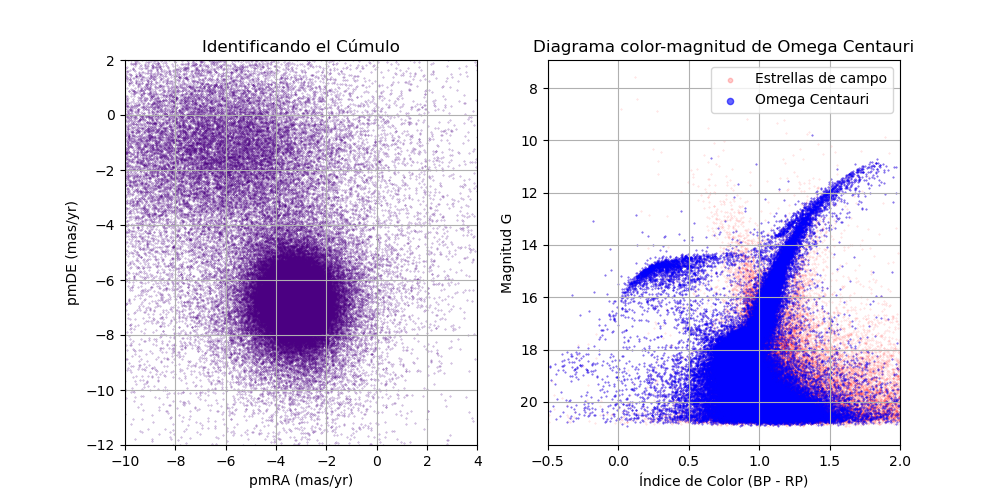

# Proyecto: Arqueología Galáctica y el Misterio de Omega Centauri

## Descripción

Este repositorio contiene un flujo de trabajo automatizado para la identificación cinemática y el análisis fotométrico del cúmulo Omega Centauri utilizando datos de la misión **Gaia DR3**.

## Estrucutura del proyecto
- `pipeline.sh`: Automatiza todo el flujo de trabajo (único script que se debe correr para reproducir los resultados)
- `1_descarga_omega.sh`: Realiza una consulta ADQL para Omega Cenrauri y extrae las columnas que se usarán para el análisis guardándolas en un archivo csv
- `2_crear_db.py`: Usa Pandas para leer el csv y limpiar los datos extraídos; además usa sqlite3 para crear la base de datos.
- `3_analisis.py`: se conecta a la base de datos y genera el mapa de movimiento propio de todas las estrellas y el diagrama color-magnitud del cúmulo.. 
- `analisis_final.png`: imagen final generada que incluye la comparativa de limpieza cinemática.
 
## Datos usados 
Se utilizaron datos fotométricos y de movimiento propio de casi 165 000 estrellas obtenidos con Vizier para el catálogo de Gaia DR3. Estos datos son magnitudes en las bandas G, BR y RP además de las coordenadas de cada objeto y sus valores de movimiento propio en ascención recta(pmRA) y declinación(pmDE).
Las magnitudes en bandas BP y RP permiten estimar el índice de color definido como (BP-RP) donde BP corresponde a la banda azul y RP a la banda roja del espectro, el color estelar es un indicador directo de la temperatura superficial.
Por otra parte el moviento propio nos permite identificar a partir de la gráfica en que coordenadas aproximadamente se encuentra el cúmulo, permitiendo limitar el analisis posterior y realizar el diagrama color-magnitud solo del cúmulo de interés, las  coordenadas de Omega Centauri en grados encontradas en SIMBAD son:
* **ra** = 201.6965
* **dec** = -47.4795

## Resultados

## Análisis de Resultados y Caracterización Física

### Identificación Cinemática 
El primer paso fundamental para este análisis de arqueología galáctica fue el aislamiento de las estrellas pertenecientes al cúmulo. Al graficar el movimiento propio (pmRA vs pmDE), se identificó una clara sobre-densidad (el "enjambre") que se diferencia del movimiento errático de las estrellas de campo de la Vía Láctea.

Debido a que existían estrellas muy alejadas del origen, se realizó un centrado estratégico de la imagen en los ejes **x=(-10, 4)** e **y=(-12, 2)**. Para extraer únicamente los miembros de Omega Centauri, se aplicaron filtros espaciales en el plano del movimiento propio con los siguientes límites:
* **pmRA (x):** [-6, 0]
* **pmDE (y):** [-9, -4.5]

Esta limpieza permitio eliminar gran parte del ruido de fondo, asegurando que el análisis fotométrico posterior sea representativo del cúmulo de estudio.

### Morfología del Diagrama Color-Magnitud (CMD)
Tras el tratamiento y filtrado de los datos de Gaia DR3, el diagrama de Hertzsprung-Russell resultante muestra una buena definición de las fases evolutivas en estrellas. Al comparar los datos brutos (en rojo) con los filtrados (en azul), se observa la importancia del proceso:

* **Secuencia Principal (MS):** Se observa una gran densidad de estrellas en la parte baja, extendiéndose hasta el punto de giro o *Turn-off* cerca de la magnitud G 18.
* **Rama de las Gigantes Rojas (RGB):** Es claramente visible la pendiente ascendente hacia el rojo, lo cual es típico en poblaciones estelares viejas. 
* **Rama Horizontal (HB):** Se identificó una rama horizontal muy extendida hacia el azul (magnitudes G entre 14 y 15). Esta estructura es un indicador de su compleja historia de formación y su posible origen como núcleo de una galaxia enana.

## Conclusiones 
El éxito del filtrado cinemático es evidente al observar la limpieza de la secuencia principal. La dispersión de puntos en la rama de las gigantes sugiere que estamos analizando un sistema con múltiples poblaciones estelares, reforzando la teoría de que Omega Centauri no es un cúmulo globular simple, sino un remanente arqueológico de un evento donde se fusionó con la Vía láctea hace miles de millones de años. 

En un cúmulo globular normal, todas las estrellas nacen al mismo tiempo y de la misma nube, por lo que la RGB debería ser muy fina. El hecho de que sea ancha en Omega Centauri confirma la presencia de múltiples poblaciones estelares con distintas metalicidades. Esto es la prueba de que el objeto tuvo suficiente masa para retener gas y formar nuevas generaciones de estrellas, algo que solo hacen las galaxias.

Es impactante observar como, partiendo de una muestra de casi 165 000 estrellas se logran reducir los datos a una fracción que representa al cúmulo mediante filtros cinemáticos. Esto demuestra que la precisión de los movimientos propios en la misión **Gaia DR3** es lo suficientemente alta como para separar objetos que están a miles de años luz de distancia con un simple análisis de racimos (clustering) visual, consultas SQL y Pandas.

